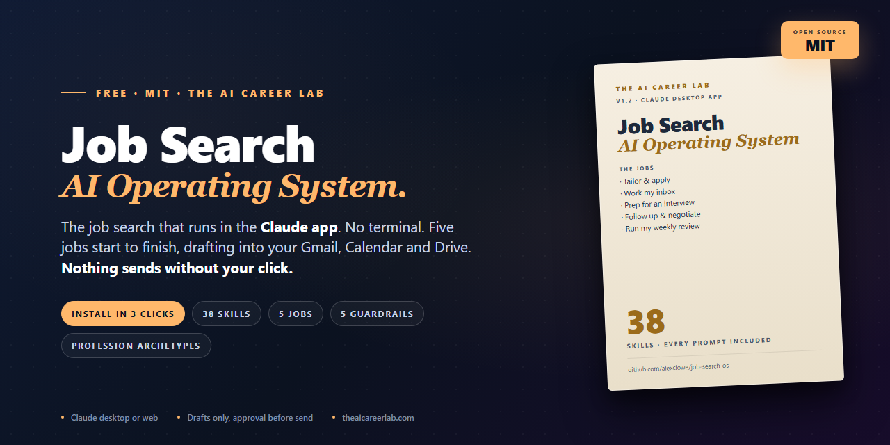
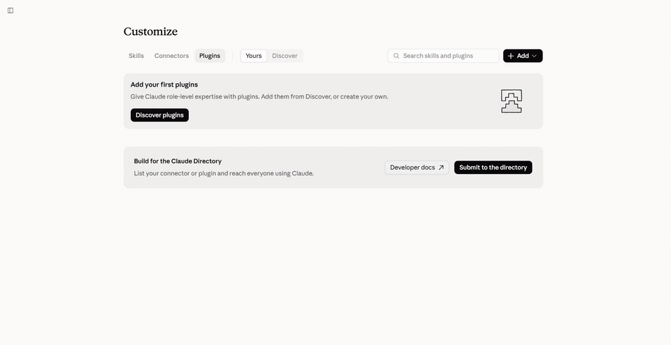
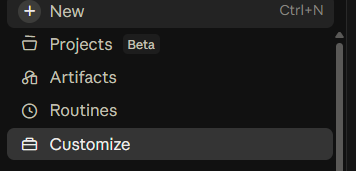
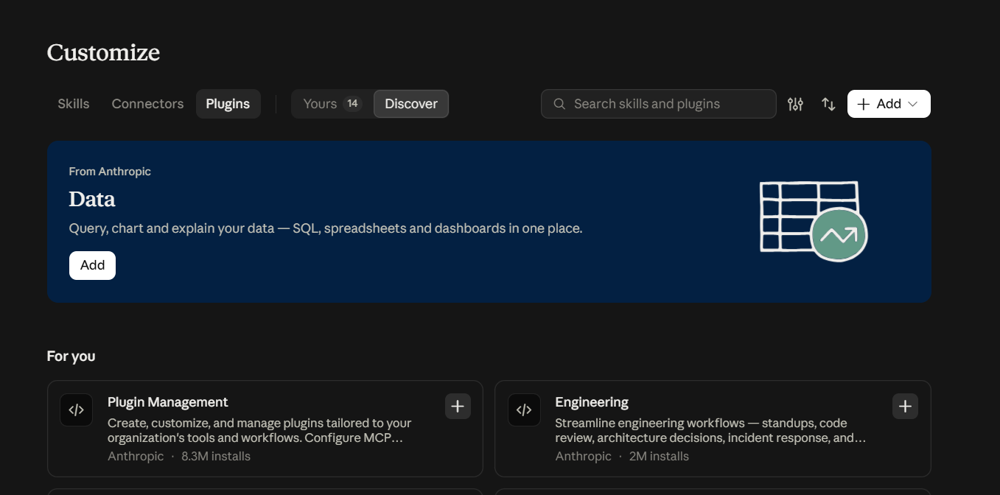
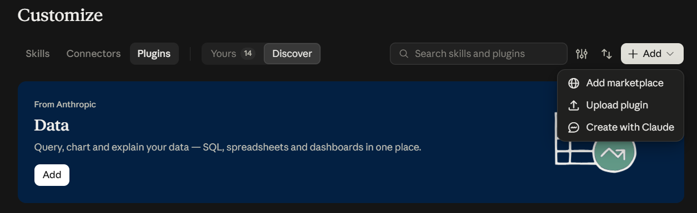
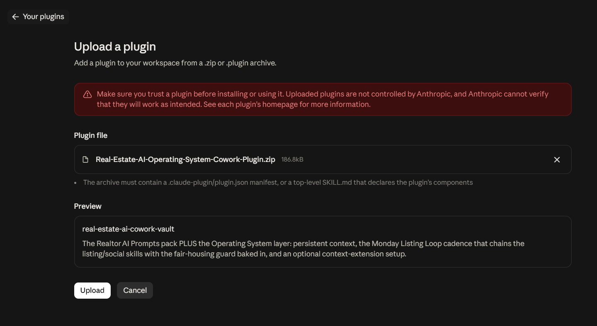
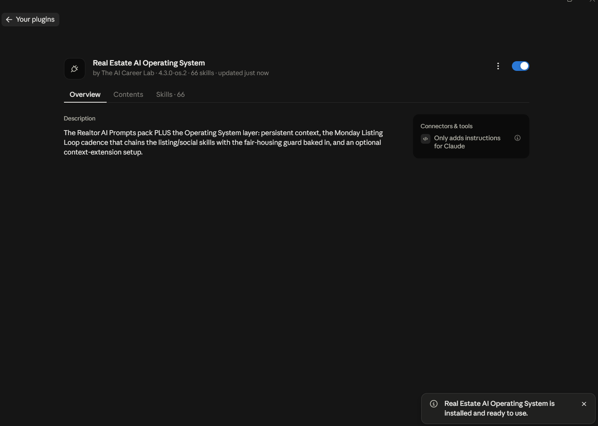
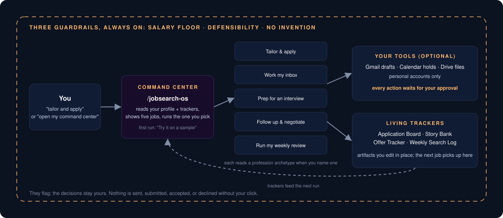

<p align="center">
  
</p>

<h1 align="center">Job Search AI Operating System</h1>

<p align="center"><strong>The job search that runs in the Claude app. No terminal, no config files, nothing to fork before you can start.</strong></p>

<p align="center">
  <a href="LICENSE"></a>
  <a href="CHANGELOG.md"></a>
  <a href="docs/skill-catalog.md"></a>
  <a href="#requirements"></a>
  <a href="https://github.com/alexclowe/job-search-os/actions/workflows/validate.yml"></a>
  <a href="https://github.com/alexclowe/job-search-os/stargazers"></a>
</p>

A free, MIT-licensed Claude plugin for anyone running a real job search, in any profession: five end-to-end jobs, living trackers, and guardrails that keep your resume honest, your time off roles below your minimum pay, and your details away from job scams. Drafts land in your own Gmail, Calendar, and Drive, and nothing is sent, submitted, accepted, or declined without your click.

It is built for how people actually get paid and where they actually are. **Hourly** (with shift differentials, overtime, and guaranteed hours), **annual salary**, **commission** (base or draw plus a split), or a **salary schedule** (step and lane): every posting and offer is checked against your minimum pay in the same unit. And every stage, from a first job to a career change or a return to work, not only senior roles.

Built by [The AI Career Lab](https://theaicareerlab.com) for people who looked at the excellent open-source job-search tools for Claude Code and thought "I don't use a terminal." Same idea. Different door. [Here is the longer version of that comparison.](https://theaicareerlab.com/blog/career-ops-ai-job-search-without-terminal)

## See it run

<!-- video:start -->
<p align="center">
  <a href="https://images.theaicareerlab.com/video/job-search-os-first-run.mp4">
    
  </a>
  <br>
  <sub>▶ Setup paste → command center → "Try it on a sample" → a tailored application filed on the Application Board. <a href="https://images.theaicareerlab.com/video/job-search-os-first-run.mp4">Watch the narrated first-run recording (mp4, 2:31).</a></sub>
</p>

**Watch each job work** (narrated, 1 to 2 minutes each, recorded on claude.ai with a fictional job seeker):

| Clip | Length | What you see |
|---|---|---|
| [Setup: resume to command center](https://images.theaicareerlab.com/video/job-search-os-setup.mp4) | 1:25 | Paste a resume, confirm one card, land on the command center |
| [Tailor & apply](https://images.theaicareerlab.com/video/job-search-os-tailor-apply.mp4) | 1:25 | Salary check first, then a tailored resume and cover letter filed on the Application Board |
| [Prep for an interview](https://images.theaicareerlab.com/video/job-search-os-interview-prep.mp4) | 1:27 | A brief for the round that is next, built from the Story Bank |
| [Follow up & negotiate](https://images.theaicareerlab.com/video/job-search-os-negotiate.mp4) | 1:32 | Thank-you note, offer worksheet with formulas, a counter built on your minimum pay |
| [Run my weekly review](https://images.theaicareerlab.com/video/job-search-os-weekly-review.mp4) | 1:16 | What moved, three moves for the week, focus blocks on the calendar |
<!-- video:end -->

## Install in three clicks

In the Claude desktop app, on any paid plan (Pro, Max, or Team):

1. **Customize → Plugins → Add ▾ → Add marketplace → Add from a repository**
2. Paste `alexclowe/job-search-os` and click **Sync**
3. Under **Discover**, click **Add** on *Job Search AI Operating System*

That is the whole install. This repository is its own one-plugin marketplace (`.claude-plugin/marketplace.json`), so there is nothing to download.

<details>
<summary><strong>Claude Code (terminal)</strong></summary>

```
/plugin marketplace add alexclowe/job-search-os
/plugin install job-search-os@job-search-os
```

The skills are the same. The connected-tools flow (Gmail, Calendar, Drive) is a Claude app feature; in Claude Code the jobs produce the same files and copy-ready drafts in your working folder.
</details>

<details>
<summary><strong>Install from a zip instead</strong></summary>

Download `job-search-os-claude-plugin-v*.zip` from the [latest release](https://github.com/alexclowe/job-search-os/releases/latest) (or the [free kit on Gumroad](https://clowealex.gumroad.com/l/job-search-ai-os), which adds the PDF guides), then:

| 1. Customize | 2. Plugins | 3. Add ▾ → Upload plugin |
|---|---|---|
|  |  |  |

| 4. Confirm the upload | 5. Installed |
|---|---|
|  |  |

</details>

### The first two minutes

1. Start a conversation **inside a Project** (the profile and trackers live there) and say **"set up my Job Search OS"**.
2. Paste your current resume. Setup asks at most three questions, saves your profile, and ends on your command center.
3. Pick **"Try it on a sample"** and choose a made-up job seeker: **Maria, a nurse moving to a clinic job (paid hourly)**, or **Sam, a data engineer going back to hands-on work (paid a salary)**. It tailors one application so you see the check card (is it real, the pay, the fit, who you know there), the resume and cover letter, the posting terms that made it in, and the Application Board row before you paste anything real.
4. Optional: say **"connect my tools"** to link Gmail, Google Calendar, and Google Drive. Personal accounts only. Not connected, you get the same work copy-paste-ready with files saved in your Project.

## What it does

Say **"open my command center"** (or `/jobsearch-os`) and pick a job. Each one runs start to finish and files its results on a living tracker.

| Job | Say | What you get | Where it lands |
|---|---|---|---|
| **Tailor & apply** | "tailor and apply", "here's a posting" | **One check card first:** is it real (scam and not-an-open-role signals, never verdicts), the pay against your minimum, your fit (strong, partial, or stretch, with the two biggest gaps), and who you know there. Then **tailor it**, **skip it**, or **get the intro first**. A tailored resume (Word) that leads with what you did and what came of it, the posting terms that made it in and the ones your record can't support yet (asked as questions, never added), a 250 to 350 word cover letter, the application-form answers (never the voluntary self-ID questions), an application note | A per-company Drive folder, the note as a Gmail draft, a row on the **Application Board** |
| **Work my inbox** | "work my inbox", "reply to this recruiter", "I got a rejection" | Every message sorted (outreach, scheduling, next round, rejection, offer), a reply drafted in your voice for each one you choose, a two-line rejection read, the board moved to the right stage | Gmail drafts in the original thread, interviews on your calendar with a prep hold, the **Application Board** updated, offers on the **Offer Tracker** |
| **Prep for an interview** | "prep me for an interview", "hiring manager round tomorrow" | A **company brief first** (every fact with a source and a date), then a 2 to 4 page brief for the round that is actually next: their likely worries with the story that answers each, your answers built from named Story Bank entries, five questions to ask back, a half-page day-of card. Then a **practice round**, one question at a time, in your profession's interview format | The company's Drive folder, a prep hold on your calendar, the **Story Bank** updated |
| **Follow up & negotiate** | "write my thank-you note", "I haven't heard back", "I got an offer" | Thank-you notes per interviewer, a two-touch follow-up cadence, an offer worksheet (Excel) with the salary check in the first line, a counter script with the exact words, a decision memo against your must-haves | Gmail drafts in the interview thread, the worksheet in Drive, dates on your calendar, the **Offer Tracker** updated |
| **Run my weekly review** | "run my weekly review", "plan my search week" | Last week in five lines, stale applications named with a decision each, **where your search stalls** (reply rate by source and the stage where applications stop, with one fix; "too few to tell yet" under 10 applications), exactly three moves with "done looks like", a not-doing list, up to five outreach drafts | Three focus blocks on your calendar, the plan in Drive, the **Weekly Search Log**. Can run every Monday on a schedule |

**Living trackers** you edit in place, in the Artifacts section of the sidebar: Application Board, Story Bank, Offer Tracker, Weekly Search Log, and People (who you know at the companies you're applying to). The next job picks up where the last one left off.

**Guardrails, always on.** They flag; the decisions stay yours.

| Guard | Speaks up when |
|---|---|
| **Is this real?** | a posting or message shows the caution signals official consumer-protection guidance names for job scams (pay to start, a check to send back, ID or bank details before an interview, an unexpected text about a job you never applied for), or softer signs it isn't an open role; signals and how to check, never a verdict |
| **Minimum pay** | a role, message, or offer pays at or below the minimum you set, compared like with like (hourly to hourly, salary to salary, a commission role's base and realistic total to yours), before you spend an hour on it |
| **Every claim holds up** | a resume, letter, or answer claims more than your record; could you back it in the room? |
| **Nothing undersold** | a real win from your record got buried, understated, or left out of a draft |
| **No invention** | a figure, title, or date has no source in your profile or resume; it becomes `[confirm]` |

**Every skill also runs on its own.** Posting decoder, resume tailor, cover letter, LinkedIn rewrite, story bank, STAR answers, recruiter-screen, hiring-manager, panel and final-round prep, reference-call prep, comp research, salary-negotiation script, counter-offer handler, decline letter, 30-60-90 plan, outbound networking, an honest answer to "how do you use AI in your work", and a severance-leverage script for the first 24 hours after a layoff. New in 1.2: a **build-a-resume-from-scratch** interview that writes a master resume in current US and Canadian conventions, a **people tracker** that reads your LinkedIn connections export and keeps only the people at companies you're applying to, **company briefs** with sources, **mock interviews**, **application-form answers**, and a **funnel report**. Type `/` in Claude to see all 38, or read the [skill catalog](docs/skill-catalog.md).

## How it works

<p align="center"></p>

The plugin is 30 markdown skill files and one manifest. There is no server, no scraper, and no code of its own; Claude reads the skill for the job you asked for, your profile, and the trackers, and does the work inside your account.

## Profession archetypes

career-ops ships archetypes for a handful of technical roles. This registry is for everyone else.

An archetype is a short, hedged brief every job reads when you name your profession: the titles hiring teams actually use, where postings tend to live, what a recruiter screens for first, the story types that land, resume conventions, how interviews usually run, how pay is usually structured, what's usually negotiable, and red flags in postings. It sharpens the posting decode, the resume ordering, interview prep, and the negotiation asks. It never puts a claim, a number, or a keyword on your resume that your own record does not support.

| Included | | |
|---|---|---|
| [Nurse](archetypes/nurse.md) | [Teacher](archetypes/teacher.md) | [Bookkeeper](archetypes/bookkeeper.md) |
| [Loan officer](archetypes/loan-officer.md) | [Paralegal](archetypes/paralegal.md) | [Real estate agent](archetypes/real-estate-agent.md) |
| [Social media manager](archetypes/social-media-manager.md) | [Personal trainer](archetypes/personal-trainer.md) | [Template for yours](archetypes/_template.md) |

Know a profession well? Copy [`archetypes/_template.md`](archetypes/_template.md), keep every line hedged and short, cite an official body for anything about licensing, run `python3 scripts/validate.py`, and open a pull request. Or start with an [archetype request](https://github.com/alexclowe/job-search-os/issues/new?template=profession-archetype.yml). The [registry index](archetypes/README.md) has the house style.

## How it compares

[ai-job-search](https://github.com/MadsLorentzen/ai-job-search) and [career-ops](https://github.com/career-ops-hq/career-ops) are outstanding, and if you live in a terminal you should look at both. This project exists for everyone else.

| | ai-job-search | career-ops | Job Search AI Operating System |
|---|---|---|---|
| Runs in | Claude Code (fork the repo) | Claude Code, Codex, OpenCode, Antigravity and others (npm) | The Claude app (desktop or web) via plugin; Claude Code too |
| Setup | git, Node, LaTeX, edit config files | npm init, YAML config, markdown CV | Three clicks, then paste your resume |
| Job portal scanning | Yes (scrapers) | Yes (many portals, zero-token triage) | No: you bring the posting |
| CV output | LaTeX / PDF templates | ATS PDF, LaTeX, markdown | Word and PDF in your Project or Drive |
| Email, calendar, files | No | No (draft-only, never sends) | Drafts into your own Gmail, Calendar, Drive, behind approval |
| Evaluation rubric | Company research checklist | A to H report, 1 to 5 score | Salary check and posting decode; no numeric score |
| Interview prep | Yes | Yes, with practice and debrief modes | Yes, by round, from your Story Bank |
| Negotiation | Salary benchmarking | Offer prep | Script that holds to your minimum pay, counter-offer handler, offer worksheet |
| Guardrails | Profile-driven | Story provenance (no invented numbers) | Minimum pay, every claim holds up, no invention; AI-register tells stripped |
| Profession focus | General, technical-leaning | Tech archetypes (LLMOps, Agentic, PM, SA, FDE, …) | Profession archetype registry (nurses, teachers, bookkeepers, …) |
| Cost to run | Free tiers possible | Free tiers possible | Needs a paid Claude plan (plugins are not on Free) |
| Licence | MIT | MIT | MIT |

Honest summary: they scan and score more; this one lives where non-developers already work and drafts into the tools they already use. Many people will be happiest using one of theirs to find postings and this one to run the application.

## Privacy and safety

- **Drafts only.** Every email is a Gmail draft, every calendar item is created for you to see, every file lands in your own Drive or Project. The plugin is written never to send, submit, accept, decline, resign, or click on your behalf.
- **Nothing leaves your Claude account.** There is no server behind this project, no telemetry, and no scraping. The skills are markdown; Claude runs them under the permissions you granted it.
- **Personal accounts only.** The connect-tools flow asks you not to link an employer's mailbox or Drive.
- **No invention.** Any figure, title, date, or employer without a source in your own record is marked `[confirm]` instead of asserted. A term a posting wants but your record doesn't show comes back as a question, never as a resume line.
- **Your contacts' data stays put.** Your LinkedIn connections export lists other people's names and jobs. It stays in your Project; only the people at companies you're applying to are copied onto your People board, and nobody is ever messaged — every intro request is a draft you send yourself.
- **Scam-aware.** Postings and recruiter messages are checked for the caution signals official consumer-protection guidance names. The plugin never drafts a "YES" reply to an unsolicited job text and never puts a Social Security or Social Insurance number, bank details, or ID into anything before a written offer.
- **Your demographic answers are yours.** It never answers the voluntary self-identification questions (race, gender, veteran, disability) on an application.
- **Not legal, tax, or salary advice.** Separation agreements, equity, non-competes, and notice periods get a "worth a professional's eyes" line, not an answer.

Details and how to report a problem: [SECURITY.md](SECURITY.md).

## Requirements

- A Claude plan that includes plugins: **Pro, Max, or Team**. Plugins are not available on the Free plan; that is the one real cost difference against the terminal tools, which can run on free tiers.
- The Claude desktop app for the three-click install and the connected tools. Claude web and Claude Code also work with the same skills.
- A Project to run it in, so your profile and trackers persist across conversations.

## FAQ

**Does it work with ChatGPT or another assistant?**
The plugin is Claude-specific. The [free kit on Gumroad](https://clowealex.gumroad.com/l/job-search-ai-os) includes a prompts edition of every skill as plain text, which runs in any assistant, minus the command center, trackers, and connected tools.

**Can I run it on a schedule?**
Yes. "Work my inbox" and "Run my weekly review" both accept **"schedule this"**. A scheduled run works from what is saved in your Project and prepares its output for review; it does not read your inbox, draft into Gmail, or touch your calendar on its own.

**What about my data?**
Your profile, resume, trackers, and drafts stay in your Claude account and, if you connected them, your own Google account. See [Privacy and safety](#privacy-and-safety).

**Does it apply to jobs for me?**
No, and it never will. It drafts; you send.

**I already use career-ops. Why would I add this?**
For the connected half: drafting replies into the real thread, holding interview time on your calendar, filing the tailored files next to the posting, and the weekly review that puts three moves on your calendar. Use career-ops to scan and score; bring the posting here to run it.

**Can I change how it writes?**
Yes, two ways. Inside your Project, ask Claude to change a skill ("make the cover letter shorter and never mention pay") and it edits the plugin conversationally. Or fork this template repository, edit the markdown, and install your fork the same three-click way with your own `owner/repo`.

## Fork and own it

This is a GitHub template repository: **Use this template → Create a new repository** gives you your own copy. Skills are plain markdown (`SKILL.md` files); change the voice, the minimum-pay rules, the job steps, or add an archetype, then install your fork with your own `owner/repo`. The [validation workflow](.github/workflows/validate.yml) runs on your fork too.

## Roadmap

- **Claude Sonnet 5.5 and Haiku 5.5.** Anthropic has said both are weeks away. The skills are model-agnostic; when they land we will re-run the smoke test and note anything that changes in the [changelog](CHANGELOG.md).
- **More archetypes.** The registry is the part of this project that gets better with every contributor. Requests and pull requests are open.
- **A Microsoft 365 Copilot Cowork edition.** Our other plugins ship for Copilot through the same converter; this one will follow once the connected-tools flow has a Copilot equivalent.
- **Smoke test on every release.** Each version is run end to end in the Claude app before the release is cut; the recording is linked at the top of this README.

## Repository layout

```
job-search-os/          the plugin (38 skills), installable as-is; mirrored from the build repo
.claude-plugin/         marketplace.json, which makes this repo its own marketplace
archetypes/             the profession archetype registry (open to pull requests)
docs/                   the jobs guide, cheat sheet, skill catalog, troubleshooting, and why it works
assets/                 banner, install screenshots, diagram, first-run preview
scripts/                validate.py and check-readme-links.py (no dependencies)
.github/                validation workflow, issue forms, pull request template
```

`job-search-os/` and `docs/` are mirrored from the private build repository on every release, so pull requests against them cannot be merged as-is. Open a [skill idea](https://github.com/alexclowe/job-search-os/issues/new?template=skill-idea.yml) instead; accepted changes are folded upstream and land in the next mirror. `archetypes/` takes pull requests directly.

## Contributing

Read [CONTRIBUTING.md](CONTRIBUTING.md). The most useful thing you can send is an archetype for a profession the tech world forgets. Ground rules: plain language, nothing that sends or submits on a user's behalf, nothing that fabricates. Be kind in issues; everyone here is either job hunting or helping someone who is. This project follows the [Contributor Covenant](CODE_OF_CONDUCT.md).

## Acknowledgements

- [MadsLorentzen/ai-job-search](https://github.com/MadsLorentzen/ai-job-search) for showing that a whole job search can live in Claude Code.
- [career-ops-hq/career-ops](https://github.com/career-ops-hq/career-ops) for the A to H rubric, story provenance, and the archetype idea this registry extends.
- Everyone who sends an archetype for a profession the tech world forgets.

## About

[The AI Career Lab](https://theaicareerlab.com) builds AI operating systems for working professionals: a command center, connected jobs, and living trackers for accountants, nurses, teachers, loan officers, real estate agents, and a dozen other professions. This one is free because a job search is a state, not a profession, and the best thing that can happen to it is that it ends.

- The plugin, as a kit with PDF guides: [clowealex.gumroad.com/l/job-search-ai-os](https://clowealex.gumroad.com/l/job-search-ai-os) (pay what you want, from $0)
- The comparison with the terminal tools: [theaicareerlab.com/blog/career-ops-ai-job-search-without-terminal](https://theaicareerlab.com/blog/career-ops-ai-job-search-without-terminal)
- Free resume prompts and the keyword gap checker: [theaicareerlab.com/resources/claude-resume-optimization-prompts](https://theaicareerlab.com/resources/claude-resume-optimization-prompts)
- Questions: alex@theaicareerlab.com

## Licence

MIT. See [LICENSE](LICENSE).
